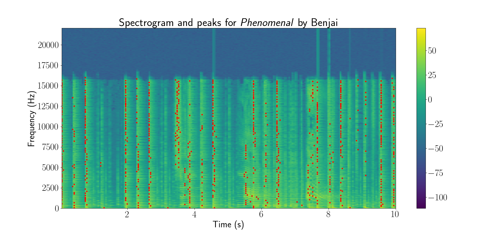
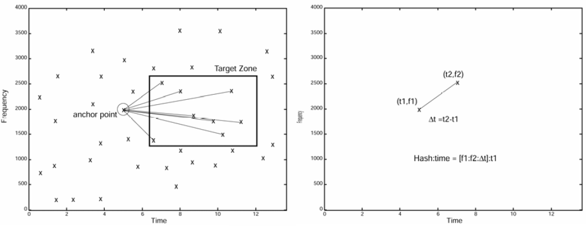
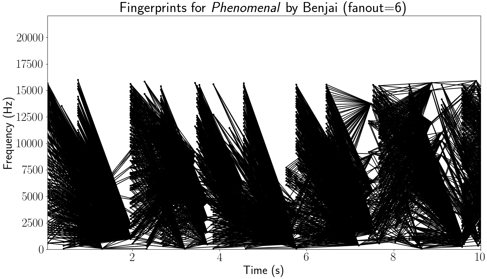

# YouTube Audio Matcher

* [Description](#description)
* [Requirements](#requirements)
* [Installation](#installation)
* [Design and Background](#background)
* [Examples](#examples)
* [Usage](#usage)
  * [`yam`](#yam-usage)
  * [`yamdb`](#yamdb-usage)
  * [`yamdl`](#yamdl-usage)
  * [`yamfp`](#yamfp-usage)
  * [Python API](#python-api)
* [Acknowledgments](#acknowledgments)

# <span id="description">Description</span>

YouTube Audio Matcher enables you to download the audio from all videos on
any number of YouTube channels, perform audio fingerprinting on audio files,
and compare the audio fingerprints to an SQL database of audio fingerprints
to help identify the audio (similar to Shazam) or, optionally, add them to the
database. Local files and directories can also be provided as input.


# <span id="requirements">Requirements</span>
* Python &ge; 3.6
* [Chromium](https://www.chromium.org) or
  [Google Chrome](https://www.google.com/chrome/) browser, and
  [ChromeDriver](http://chromedriver.chromium.org/home)
* [FFmpeg](https://ffmpeg.org/download.html)
* PostgreSQL or MySQL client/driver (see list of
  [SQLAlchemy–supported drivers/backends](https://docs.sqlalchemy.org/en/13/core/engines.html))


# <span id="installation">Installation</span>

First, install the Python package.

```
git clone https://github.com/nrsyed/youtube-audio-matcher.git
cd youtube-audio-matcher
pip install .
```

Next, install a PostgreSQL or MySQL client and development files. These must
be installed before the SQL driver is installed with `pip`, as the
`pip install` requires them to build the relevant Python packages. Example
instructions for installing PostgreSQL/psycopg2 and MySQL/mysqlclient on Ubuntu
are shown below.

**PostgreSQL and psycopg2**
```
sudo apt install libpq-dev
pip install psycopg2
```

**MySQL and mysqlclient**
```
sudo apt install libmysqlclient-dev mysql-client-core-8.0
pip install mysqlclient
```


# <span id="background">Design and Background</span>

The program leverages Python asynchronous functions and coroutines, combined
with multithreading and multiprocessing, to efficiently download and/or process
files, summarized in the flow diagram below.


Any number of YouTube channel/user URLs and local files/directories can be
provided as input. A webscraping coroutine (the "get video metadata from page
source" block in the diagram) gets (via
[Selenium](https://github.com/SeleniumHQ/selenium/)) and parses (via
[BeautifulSoup](https://www.crummy.com/software/BeautifulSoup/))
the complete page source for each URL and extracts information on each video
on the channel/user Videos page, namely the YouTube ID, duration, title. The
videos are filtered based on criteria supplied by the user (e.g., exclude
videos longer and/or shorter than a certain duration), after which they're
added to a download queue. A download coroutine ("download videos as mp3")
kicks off each download in a thread pool, in which each video is downloaded
via youtube-dl and converted to MP3 by ffmpeg. As each download completes, it's
added to a fingerprint queue. Any local files provided as input are
added directly to the fingerprint queue, since they don't need to be
downloaded. A third coroutine ("fingerprint songs") consumes songs from the
fingerprint queue and sends them to a process pool, where they are
fingerprinted using all available CPUs (see the
[Audio fingerprinting](#audio-fingerprinting) sub-section below). After
fingerprinting, each video is added to a database queue.

If the user opted to add songs to the database, the fingerprinted files are
passed to a coroutine that uses the process pool to add songs and their
fingerprints to the database.

If the user instead opted to match the input songs against the fingerprints
already in the database, the songs are passed to a coroutine that uses the
process pool to query the database and determine if there's a match. All
matches are ultimately returned (and optionally written to a text file as
JSON).

By offloading I/O-heavy downloads to a thread pool and CPU-heavy fingerprinting
and matching to other CPUs, a large number of files can be processed quickly.

## Audio fingerprinting

Audio fingerprinting refers to the act of turning audio into a set of hashes.
The first step of this involves obtaining the
[spectrogram](https://en.wikipedia.org/wiki/Spectrogram) of the song/audio,
which is effectively a measure of the intensity of the sound frequencies of the
audio over the course of the song. The spectrogram of the song *Phenomenal* by
Benjai is shown below (the images in this section were generated by the
[`yamfp`](#yamfp-usage) tool).


Next, we find the peaks in the spectrogram, i.e., the points in the spectrogram
with the greatest amplitude. The spectrogram for the first 10 seconds of the
song is shown below, with the peaks represented by red dots.



The song's fingerprints are generated from peaks of pairs in a process known
as combinatorial hashing, where we iterate through the peaks and, for each
peak, form pairs with its neighbors. The number of neighbors we consider is
termed the *fanout* value. This is shown in the figures below, which are taken
from the paper by Avery Wang, the founder of Shazam (see
[Acknowledgments](#acknowledgments)).



The figure defines a "target zone" that determines which neighbors to consider
for each peak. Each peak pair is used to generate a hash based on the frequency
and time difference between each point—this constitutes a fingerprint. If we
use a target zone of +1 s to +10 s (and no restriction on the frequency) with a
fanout value of 2, the first 10 seconds of the song generate the following
*hash constellation*:


If we increase the fanout value to 6, it looks more like the following:



Increasing the fanout value results in more hash pairs, increasing the
robustness of the fingerprints but also increasing storage requirements
and computation time to find matches, since there can be tens or hundreds
of thousands of hash pairs for an entire song.

More on the algorithm used to match audio fingerprints to fingerprints in the
database can be found in the paper and in the source code (see the function
`youtube_audio_matcher.audio.fingerprint.align_matches`).


# <span id="examples">Examples</span>

### Add songs/fingerprints to the database

This command (which makes use of the package's `yam` command-line tool)
adds to the database (`-A`) a local file (`file1.mp3`), all files from a local
directory (`sample_directory`), and the first 60 seconds (`--duration 60`) of
audio from all videos on a YouTube channel (`www.youtube.com/c/sample_channel`),
excluding any videos shorter than 5 seconds (`-S 5`) or longer than 300 seconds
(`-L 300`), using the (PostgreSQL) database credentials `-U yam` (user `yam`),
`-N yam` (database name `yam`), and database password `yam` (`-P yam`).

**Command**:
```
yam -A www.youtube.com/c/sample_channel file1.mp3 sample_directory \
  -S 5 -L 300 --duration 60 -U yam -N yam -P yam
```

**Output**:
```
[INFO] Fingerprinted /home/sample_directory/file3.mp3 (44570 hashes)
[INFO] Fingerprinted /home/sample_directory/file2.mp3 (89020 hashes)
[INFO] Fingerprinted /home/file1.mp3 (216960 hashes)
[INFO] Successfully downloaded /home/Z6_7orLq0D.mp3
[INFO] Added /home/sample_directory/file3.mp3 to database (4.56 s)
[INFO] Fingerprinted /home/Z6_7orLq0D.mp3 (75470 hashes)
[INFO] Successfully downloaded /home/s71A5oUut3.mp3
[INFO] Successfully downloaded /home/wFoxOcQU60.mp3
[INFO] Added /home/sample_directory/file2.mp3 to database (9.04 s)
[INFO] Fingerprinted /home/wFoxOcQU60.mp3 (89020 hashes)
[INFO] Fingerprinted /home/s71A5oUut3.mp3 (216960 hashes)
[INFO] Added /home/Z6_7orLq0D.mp3 to database (8.06 s)
[INFO] Added /home/wFoxOcQU60.mp3 to database (8.89 s)
[INFO] Added /home/file1.mp3 to database (21.22 s)
[INFO] Added /home/s71A5oUut3.mp3 to database (19.88 s)
[INFO] All songs added to database (25.13 s)
```

### Match songs against the database

This command (which makes use of the package's `yam` command-line tool)
fingerprints a local file (`file4.mp3`) as well as downloads/fingerprints
audio from all videos on two YouTube users/channels
(`youtube.com/c/some_channel youtube.com/u/some_user`), excluding videos longer
than 600 seconds (`-L 300`), deletes any downloaded files after fingerprinting
(`-D`), and matches all fingerprints against those in the (PostgreSQL) database
with the database credentials `-U yam` (user `yam`), `-N yam`
(database name `yam`), and database password `yam` (`-P yam`).

**Command**:
```
yam youtube.com/c/some_channel youtube.com/u/some_user file4.mp3 \
  -L 600 -D -U yam -N yam -P yam
```

The output contains matches (if any) as well as information on each match,
including the `confidence` (number of matching fingerprints divided by total
number of input song fingerprints) and `relative_offset` (which part of the
matched song the input song corresponds to, in seconds); in other words, a
`relative_offset` of 300 means that the beginning of the input song corresponds
to the 300-second mark in the matched song from the database.

**Output**:
```
[INFO] Fingerprinted /home/file4.mp3 (11520 hashes)
[INFO] Matching fingerprints for /home/file4.mp3
[INFO] Successfully downloaded /home/pzvDf_H7db.mp3
[INFO] Successfully downloaded /home/Rv4nWAZw8V.mp3
[INFO] Successfully downloaded /home/iPTmeNCao7.mp3
[INFO] Fingerprinted /home/pzvDf_H7db.mp3 (32650 hashes)
[INFO] Matching fingerprints for /home/pzvDf_H7db.mp3
[INFO] Fingerprinted /home/Rv4nWAZw8V.mp3 (22520 hashes)
[INFO] Matching fingerprints for /home/Rv4nWAZw8V.mp3
[INFO] Fingerprinted /home/iPTmeNCao7.mp3 (73860 hashes)
[INFO] Matching fingerprints for /home/iPTmeNCao7.mp3
[INFO] Finished matching fingerprints for /home/file4.mp3 in 10.28 s
[INFO] Finished matching fingerprints for /home/Rv4nWAZw8V.mp3 in 2.68 s
[INFO] Finished matching fingerprints for /home/iPTmeNCao7.mp3 in 7.21 s
[INFO] Finished matching fingerprints for /home/pzvDf_H7db.mp3 in 10.14 s
[INFO] Match 1:
{
    "youtube_id": null,
    "title": null,
    "duration": null,
    "channel_url": null,
    "path": "/home/file4.mp3",
    "filehash": "e0bf9d28e9b2409b7ad181b97f532569d27c9633",
    "num_fingerprints": 11520,
    "matching_song": {
        "id": 8,
        "duration": 436.0,
        "filehash": "c12b119ab98caee4a24eef5e7b3f4d7bf2b38f99",
        "filepath": "/home/song2.mp3",
        "title": null,
        "youtube_id": null,
        "num_fingerprints": 812890
    },
    "match_stats": {
        "num_matching_fingerprints": 3352,
        "confidence": 0.29097222222222224,
        "iou": 0.004082537409050274,
        "relative_offset": 300.0
    }
}

[INFO] Match 2:
{
    "youtube_id": "iPTmeNCao7",
    "title": "Sample YT video title",
    "duration": 177,
    "channel_url": "https://www.youtube.com/c/some_channel/videos",
    "path": "/home/iPTmeNCao7.mp3",
    "filehash": "6b59b4c301de5ad3f7dddcdb78fbf62bd1618cab",
    "num_fingerprints": 73860,
    "matching_song": {
        "id": 3,
        "duration": 155.0,
        "filehash": "6ba1139a7fc8cde33ff30065b45ed3c9f457f5a6",
        "filepath": "/home/a92_Uxy5mq.mp3",
        "title": "Some other video on youtube",
        "youtube_id": "a92_Uxy5mq",
        "num_fingerprints": 216960
    },
    "match_stats": {
        "num_matching_fingerprints": 73821,
        "confidence": 0.9994719740048741,
        "iou": 0.3401905077903585,
        "relative_offset": 0.0
    }
}
```

### Print all songs in the database

**Command**:
```
yamdb -s -U yam -N yam -P yam
```

**Output**:
```
[
  {
    "id": 3,
    "duration": 155.0,
    "filehash": "6ba1139a7fc8cde33ff30065b45ed3c9f457f5a6",
    "filepath": "/home/a92_Uxy5mq.mp3",
    "title": "Some other video on youtube",
    "youtube_id": "a92_Uxy5mq",
  },
  {
    "id": 8,
    "duration": 436.0,
    "filehash": "c12b119ab98caee4a24eef5e7b3f4d7bf2b38f99",
    "filepath": "/home/song2.mp3",
    "title": null,
    "youtube_id": null,
  }
]
```

### Drop all tables in the database
```
yamdb -r -U yam -N yam -P yam
```

### Plot a song's audio fingerprint/spectrogram

The `yamfp` tool was used to create the spectrogram/fingerprint figures in the
background section above.

```
yamfp /path/to/file.mp3
```

### Download audio from all videos on multiple YouTube channels

The YouTube audio download functionality from the `yam` command also exists
as a standalone command-line tool: `yamdl` (this simply downloads videos as MP3
files without fingerprinting them or interacting with the database in any way).

The following command downloads the first 30 seconds of audio (`--end 30`) from
all videos on two channels
(`youtube.com/user/ytuser youtube.com/c/somechannel/videos`), excluding
videos shorter than 7 seconds (`-S 7`) or longer than 20 minutes (`-L 1200`),
saves them to a specified directory (`-d /path/to/dest_dir`), skips any files
that already exist in the destination directory (`-i`), waits 4 seconds for
YouTube pages to load in the browser after each page scroll (`-p 4`) to ensure
the page has time to load and the entire page source is obtained/scraped
(increasing this wait time can help on slower internet connections), and
retries failed downloads up to 10 times (`-r 10`) in case youtube-dl fails
to download videos, which occasionally happens.

**Command**:
```
yamdl youtube.com/user/ytuser youtube.com/c/somechannel/videos \
  --end 30 -S 7 -L 1200 -d /path/to/dest_dir -i -p 4 -r 10
```

All `yamdl` options can also be used with `yam`.


# <span id="usage">Usage</span>

This package contains four command line tools/commands. The main tool is
`yam` (**Y**ouTube **A**udio **M**atcher), which combines download,
fingerprinting, and database functionality. Each of these three components
also have their own command line interfaces: `yamdb` (**YAM** **D**ata**b**ase
tool), `yamdl` (**YAM** **D**own**l**oad tool), and `yamfp`
(**YAM** **F**inger**p**rint tool).


## <span id="yam-usage">`yam`</span>

```
usage: yam [-h] [-N <database_name>] [-C <dialect>] [-R <driver>] [-H <host>]
           [-P <password>] [-O <port>] [-U <username>] [-d <path>]
           [-L <seconds>] [-S <seconds>] [-i] [-p <seconds>] [-r <num>] [-y]
           [--start <seconds>] [--end <seconds>] [--duration <seconds>]
           [--erosion-iterations <int>] [-f <int>]
           [--filter-connectivity {1,2}] [--filter-dilation <int>] [-l <int>]
           [--max-time-delta <float>] [--min-time-delta <float>] [-a <dB>]
           [--spectrogram-backend {scipy,matplotlib}]
           [--win-overlap-ratio <float>] [--win-size <int>] [-A] [-c <float>]
           [-D] [--max-processes <num>] [--max-threads <num>] [-o [path]]
           [--debug] [-s]
           inputs [inputs ...]

positional arguments:
  inputs                One or more space-separated input sources (YouTube
                        channel/user URL, local path to audio file, or local
                        path to a directory of audio files)

optional arguments:
  -h, --help            show this help message and exit
  -A, --add-to-database
                        Add files to the database after fingerprinting instead
                        of searching the database for matches (default: False)
  -c <float>, --conf-thresh <float>
                        Confidence threshold for matches (default: 0.05)
  -D, --delete          Delete downloaded files after fingerprinting (default:
                        False)
  --max-processes <num>
                        Max number of CPUs for parallel processing (default:
                        None)
  --max-threads <num>   Max number of threads for concurrent tasks (default:
                        None)
  -o [path], --output [path]
                        Path to output file containing matches in JSON format;
                        if this option is provided without an argument, a
                        timestamped filename is generated and written to the
                        current directory (default: None)

database arguments:
  -N <database_name>, --db-name <database_name>
                        Database name (default: yam)
  -C <dialect>, --dialect <dialect>
                        SQL dialect (default: postgresql)
  -R <driver>, --driver <driver>
                        SQL dialect driver (default: None)
  -H <host>, --host <host>
                        Database hostname (default: localhost)
  -P <password>, --password <password>
                        Database password (default: None)
  -O <port>, --port <port>
                        Database port number (default: None)
  -U <username>, --user <username>
                        Database user name (default: None)

download arguments:
  -d <path>, --dst-dir <path>
                        Path to destination directory for downloaded files
                        (default: .)
  -L <seconds>, --exclude-longer-than <seconds>
                        Do not download/convert videos longer than specified
                        duration. This does NOT truncate videos to a maximum
                        desired length; to extract or truncate specific
                        segments of audio from downloaded videos, use --start,
                        --end, and/or --duration (default: None)
  -S <seconds>, --exclude-shorter-than <seconds>
                        Do not download/convert videos shorter than specified
                        duration (default: None)
  -i, --ignore-existing
                        Do not download files that already exist (default:
                        False)
  -p <seconds>, --page-load-wait <seconds>
                        Time to wait (in seconds) to allow page to load on
                        initial page load and and after each page scroll
                        (default: 1)
  -r <num>, --retries <num>
                        Number of times to re-attempt failed downloads. Pass
                        -1 to retry indefinitely until successful (default: 5)
  -y, --youtubedl-verbose
                        Enable youtube-dl and ffmpeg terminal output (default:
                        False)
  --start <seconds>     Extract audio beginning at the specified video time
                        (in seconds) (default: None)
  --end <seconds>       Extract audio up to the specified video time (in
                        seconds) (default: None)
  --duration <seconds>  Duration (in seconds) of audio to extract beginning at
                        0 if --start not specified, otherwise at --start. If
                        --duration is used with --end, --duration takes
                        precedence. (default: None)

fingerprint arguments:
  --erosion-iterations <int>
                        Number of times to apply binary erosion for peak
                        finding (default: 1)
  -f <int>, --fanout <int>
                        Number of adjacent peaks to consider for generating
                        hashes (default: 10)
  --filter-connectivity {1,2}
                        Max filter neighborhood connectivity for peak finding
                        (default: 1)
  --filter-dilation <int>
                        Max filter dilation (neighborhood size) for peak
                        finding (default: 10)
  -l <int>, --hash-length <int>
                        Truncate fingerprint SHA1 hashes to --hash-length (max
                        40) (default: 40)
  --max-time-delta <float>
                        Target zone max time offset difference for hashes
                        (default: 100)
  --min-time-delta <float>
                        Target zone min time offset difference for hashes
                        (default: 0)
  -a <dB>, --min-amplitude <dB>
                        Spectogram peak minimum amplitude in dB (default: 10)
  --spectrogram-backend {scipy,matplotlib}
                        Library to use for computing spectrogram (default:
                        scipy)
  --win-overlap-ratio <float>
                        Window overlap as a fraction of window size, in the
                        range [0, 1) (default: 0.5)
  --win-size <int>      Number of samples per FFT window (default: 4096)

Verbosity arguments:
  --debug               Print verbose debugging info (default: False)
  -s, --silent          Suppress youtube-audio-matcher terminal output
                        (default: False)
```


## <span id="yamdb-usage">`yamdb`</span>

```
usage: yamdb [-h] [-N <database_name>] [-C <dialect>] [-R <driver>]
             [-H <host>] [-P <password>] [-O <port>] [-U <username>]
             [-d | -r | -o <path> | -s]

optional arguments:
  -h, --help            show this help message and exit

database arguments:
  -N <database_name>, --db-name <database_name>
                        Database name (default: yam)
  -C <dialect>, --dialect <dialect>
                        SQL dialect (default: postgresql)
  -R <driver>, --driver <driver>
                        SQL dialect driver (default: None)
  -H <host>, --host <host>
                        Database hostname (default: localhost)
  -P <password>, --password <password>
                        Database password (default: None)
  -O <port>, --port <port>
                        Database port number (default: None)
  -U <username>, --user <username>
                        Database user name (default: None)

actions:
  -d, --delete          Delete all rows (default: False)
  -r, --drop            Drop all tables (default: False)
  -o <path>, --output <path>
                        Write the contents of the database to an output file
                        as JSON (default: None)
  -s, --songs           Print a list of songs in the database (default: False)
```


## <span id="yamdl-usage">`yamdl`</span>

```
usage: yamdl [-h] [-d <path>] [-L <seconds>] [-S <seconds>] [-i]
             [-p <seconds>] [-r <num>] [-y] [--start <seconds>]
             [--end <seconds>] [--duration <seconds>] [--debug] [-s]
             urls [urls ...]

Efficiently and quickly download the audio from all videos on one or more
YouTube channels, filter based on video length, and extract audio only from
the segments of interest.

positional arguments:
  urls                  One or more space-separated channel/user URLs (e.g.,
                        www.youtube.com/c/YouTubeCreators). Options apply to
                        all URLs.

optional arguments:
  -h, --help            show this help message and exit

download arguments:
  -d <path>, --dst-dir <path>
                        Path to destination directory for downloaded files
                        (default: .)
  -L <seconds>, --exclude-longer-than <seconds>
                        Do not download/convert videos longer than specified
                        duration. This does NOT truncate videos to a maximum
                        desired length; to extract or truncate specific
                        segments of audio from downloaded videos, use --start,
                        --end, and/or --duration (default: None)
  -S <seconds>, --exclude-shorter-than <seconds>
                        Do not download/convert videos shorter than specified
                        duration (default: None)
  -i, --ignore-existing
                        Do not download files that already exist (default:
                        False)
  -p <seconds>, --page-load-wait <seconds>
                        Time to wait (in seconds) to allow page to load on
                        initial page load and and after each page scroll
                        (default: 1)
  -r <num>, --retries <num>
                        Number of times to re-attempt failed downloads. Pass
                        -1 to retry indefinitely until successful (default: 5)
  -y, --youtubedl-verbose
                        Enable youtube-dl and ffmpeg terminal output (default:
                        False)
  --start <seconds>     Extract audio beginning at the specified video time
                        (in seconds) (default: None)
  --end <seconds>       Extract audio up to the specified video time (in
                        seconds) (default: None)
  --duration <seconds>  Duration (in seconds) of audio to extract beginning at
                        0 if --start not specified, otherwise at --start. If
                        --duration is used with --end, --duration takes
                        precedence. (default: None)

Verbosity arguments:
  --debug               Print verbose debugging info (default: False)
  -s, --silent          Suppress youtube-audio-matcher terminal output
                        (default: False)
```


## <span id="yamfp-usage">`yamfp`</span>

```
usage: yamfp [-h] [--erosion-iterations <int>] [-f <int>]
             [--filter-connectivity {1,2}] [--filter-dilation <int>]
             [--max-time-delta <float>] [--min-time-delta <float>] [-a <dB>]
             [--spectrogram-backend {scipy,matplotlib}]
             [--win-overlap-ratio <float>] [--win-size <int>]
             [-c <channel> [<channel> ...]] [-p] [-F] [-t <title>]
             [--start <seconds>] [--end <seconds>]
             <path>

Visualize an audio file fingerprint by plotting its spectrogram, spectrogram
peaks, and/or fingerprint (peak pairs).

positional arguments:
  <path>                Path to audio file

optional arguments:
  -h, --help            show this help message and exit
  -c <channel> [<channel> ...], --channels <channel> [<channel> ...]
                        Plot only the specified audio channels (beginning at
                        0) (default: None)
  -p, --no-peaks        Do not plot spectrogram peaks (default: False)
  -F, --plot-fingerprints
                        Plot fingerprint constellations between peak pairs
                        instead of plotting spectrogram (default: False)
  -t <title>, --title <title>
                        Set plot title; defaults to filename if omitted
                        (default: None)
  --start <seconds>     Audio segment end time in seconds (beginning of file
                        if omitted) (default: None)
  --end <seconds>       Audio segment end time in seconds (end of file if
                        omitted) (default: None)

fingerprint arguments:
  --erosion-iterations <int>
                        Number of times to apply binary erosion for peak
                        finding (default: 1)
  -f <int>, --fanout <int>
                        Number of adjacent peaks to consider for generating
                        hashes (default: 3)
  --filter-connectivity {1,2}
                        Max filter neighborhood connectivity for peak finding
                        (default: 1)
  --filter-dilation <int>
                        Max filter dilation (neighborhood size) for peak
                        finding (default: 10)
  --max-time-delta <float>
                        Target zone max time offset difference for hashes
                        (default: 10)
  --min-time-delta <float>
                        Target zone min time offset difference for hashes
                        (default: 1)
  -a <dB>, --min-amplitude <dB>
                        Spectogram peak minimum amplitude in dB (default: 10)
  --spectrogram-backend {scipy,matplotlib}
                        Library to use for computing spectrogram (default:
                        scipy)
  --win-overlap-ratio <float>
                        Window overlap as a fraction of window size, in the
                        range [0, 1) (default: 0.5)
  --win-size <int>      Number of samples per FFT window (default: 4096)
```


## <span id="python-api">Python API</span>
The package and its submodules can be imported directly in Python:

```
import youtube_audio_matcher as yam

import youtube_audio_matcher.audio
import youtube_audio_matcher.database
import youtube_audio_matcher.download
```

Refer to https://nrsyed.github.io/youtube-audio-matcher for complete
Python API documentation.


# <span id="acknowledgments">Acknowledgments</span>
This project was inspired by
whose goal is to try and identify unknown songs by checking YouTube channels
for matching videos.

* [Audio Fingerprinting with Python and Numpy](https://willdrevo.com/fingerprinting-and-audio-recognition-with-python/) and [dejavu](https://github.com/worldveil/dejavu)
* Avery Li-Chun Wang, "An Industrial-Strength Audio Search Algorithm,"
Proc. 2003 ISMIR, Baltimore, MD, Oct. 2003.
https://www.ee.columbia.edu/~dpwe/papers/Wang03-shazam.pdf
* Ben-0-mad's [YT-TMS-Finder](https://github.com/Ben-0-mad/YT-TMS-Finder) repo,
whose goal is to identify unknown songs by checking YouTube channels for
matching videos, served as the inspiration for YouTube Audio Matcher.
* [How does Shazam work](http://coding-geek.com/how-shazam-works/)
