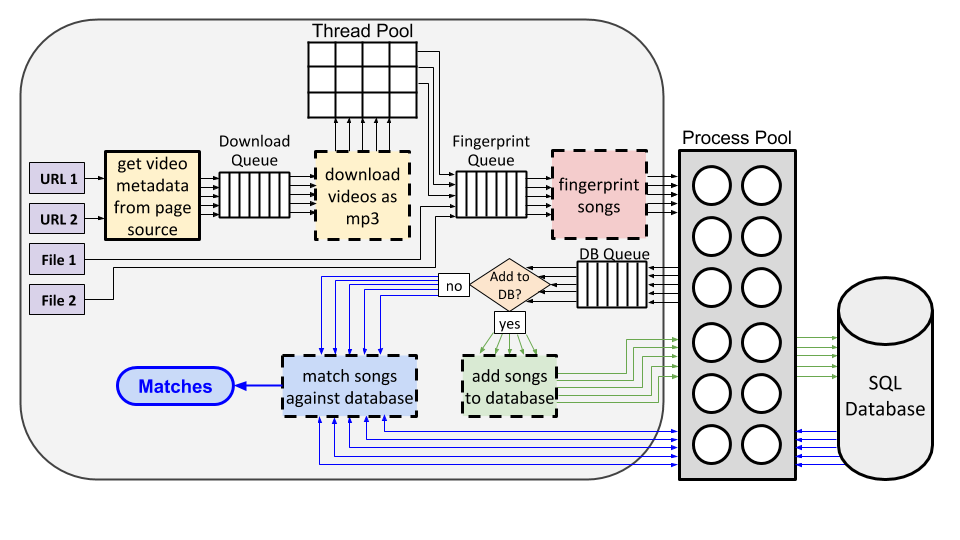

# YouTube Audio Matcher

* [Description](#description)
* [Requirements](#requirements)
* [Installation](#installation)
* [Examples](#examples)
  * [Command line interface](#cli-examples)
  * [Python](#python-examples)
* [Usage](#usage)
  * [Command line interface](#cli)
  * [Import as Python package](#import)
* [Acknowledgments](#acknowledgments)

# Description


# <span id="requirements">Requirements</span>
* Python &ge; 3.6
* [Chromium](https://www.chromium.org) or
  [Google Chrome](https://www.google.com/chrome/) browser, and
  [ChromeDriver](http://chromedriver.chromium.org/home)
* FFmpeg (install from your distribution's package repository, if on a
  Unix-based system (e.g., `apt install ffmpeg`), or from
  [https://ffmpeg.org](https://ffmpeg.org/download.html))
* PostgreSQL or MySQL client/driver (see list of
  [SQLAlchemy–supported drivers/backends](https://docs.sqlalchemy.org/en/13/core/engines.html))

# <span id="installation">Installation</span>

First, install the Python package.

```
git clone https://github.com/nrsyed/youtube-audio-matcher.git
cd youtube-audio-matcher
pip install .
```

Next, install a PostgreSQL or MySQL client and development files. These must
be installed before a Python SQLAlchemy is installed with `pip`, as the
`pip install` requires these to build/install the relevant Python packages.
Example instructions for installing PostgreSQL/psycopg2 and MySQL/mysqlclient
on Ubuntu are shown below.

**PostgreSQL and psycopg2**
```
sudo apt install libpq-dev
pip install psycopg2
```

**MySQL and mysqlclient**
```
sudo apt install libmysqlclient-dev mysql-client-core-8.0
pip install mysqlclient
```

# <span id="examples">Examples</examples>

For complete usage, see the [Usage](#usage) section.

## <span id="cli-examples">Command line interface</span>
The following example demonstrates the command and sample output for
downloading up to the first 60 seconds (`--duration 60`) of audio from all
videos from two YouTube users/channels to the `~/yt_mp3s` directory
(`-d ~/yt_mp3s`), excluding videos that are longer than 300 seconds (`-L 300`)
or shorter than 5 seconds (`-S 5`). youtube-dl and ffmpeg produce verbose
output that can be suppressed with the `-q` switch.

```
TODO
```

## <span id="python-examples">Python</span>

The following Python code performs the same actions as the command line example
above:

```
TODO
```

# <span id="usage">Usage</span>

This package contains four command line tools/commands. The main tool is
`yam` (**Y**ouTube **A**udio **M**atcher).

## <span id="cli">Command line interface</span>

```
usage: yam [-h] [-N <database_name>] [-C <dialect>] [-R <driver>] [-H <host>]
           [-P <password>] [-O <port>] [-U <username>] [-d <path>]
           [-L <seconds>] [-S <seconds>] [-i] [-p <seconds>] [-r <num>] [-y]
           [--start <seconds>] [--end <seconds>] [--duration <seconds>]
           [--erosion-iterations <int>] [-f <int>]
           [--filter-connectivity {1,2}] [--filter-dilation <int>] [-l <int>]
           [--max-time-delta <float>] [--min-time-delta <float>] [-a <dB>]
           [--spectrogram-backend {scipy,matplotlib}]
           [--win-overlap-ratio <float>] [--win-size <int>] [-A] [-c <float>]
           [-D] [-o [path]] [--debug] [-s]
           inputs [inputs ...]

positional arguments:
  inputs                One or more space-separated input sources (YouTube
                        channel/user URL, local path to audio file, or local
                        path to a directory of audio files)

optional arguments:
  -h, --help            show this help message and exit
  -A, --add-to-database
                        Add files to the database after fingerprinting instead
                        of searching the database for matches (default: False)
  -c <float>, --conf-thresh <float>
                        Confidence threshold for matches (default: 0.1)
  -D, --delete          Delete downloaded files after fingerprinting (default:
                        False)
  -o [path], --output [path]
                        Path to output file containing matches in JSON format;
                        if this option is provided without an argument, a
                        timestamped filename is generated and written to the
                        current directory (default: None)

database arguments:
  -N <database_name>, --db-name <database_name>
                        Database name (default: yam)
  -C <dialect>, --dialect <dialect>
                        SQL dialect (default: postgresql)
  -R <driver>, --driver <driver>
                        SQL dialect driver (default: None)
  -H <host>, --host <host>
                        Database hostname (default: localhost)
  -P <password>, --password <password>
                        Database password (default: None)
  -O <port>, --port <port>
                        Database port number (default: None)
  -U <username>, --user <username>
                        Database user name (default: None)

download arguments:
  -d <path>, --dst-dir <path>
                        Path to destination directory for downloaded files
                        (default: .)
  -L <seconds>, --exclude-longer-than <seconds>
                        Do not download/convert videos longer than specified
                        duration. This does NOT truncate videos to a maximum
                        desired length; to extract or truncate specific
                        segments of audio from downloaded videos, use --start,
                        --end, and/or --duration (default: None)
  -S <seconds>, --exclude-shorter-than <seconds>
                        Do not download/convert videos shorter than specified
                        duration (default: None)
  -i, --ignore-existing
                        Do not download files that already exist (default:
                        False)
  -p <seconds>, --page-load-wait <seconds>
                        Time to wait (in seconds) to allow page to load on
                        initial page load and and after each page scroll
                        (default: 1)
  -r <num>, --retries <num>
                        Number of times to re-attempt failed downloads. Pass
                        -1 to retry indefinitely until successful (default: 5)
  -y, --youtubedl-verbose
                        Enable youtube-dl and ffmpeg terminal output (default:
                        False)
  --start <seconds>     Extract audio beginning at the specified video time
                        (in seconds) (default: None)
  --end <seconds>       Extract audio up to the specified video time (in
                        seconds) (default: None)
  --duration <seconds>  Duration (in seconds) of audio to extract beginning at
                        0 if --start not specified, otherwise at --start. If
                        --duration is used with --end, --duration takes
                        precedence. (default: None)

fingerprint arguments:
  --erosion-iterations <int>
                        Number of times to apply binary erosion for peak
                        finding (default: 1)
  -f <int>, --fanout <int>
                        Number of adjacent peaks to consider for generating
                        hashes (default: 10)
  --filter-connectivity {1,2}
                        Max filter neighborhood connectivity for peak finding
                        (default: 1)
  --filter-dilation <int>
                        Max filter dilation (neighborhood size) for peak
                        finding (default: 10)
  -l <int>, --hash-length <int>
                        Truncate each fingerprint SHA1 hash to --hash-length
                        (max 40) (default: 40)
  --max-time-delta <float>
                        Target zone max time offset difference for hashes
                        (default: 100)
  --min-time-delta <float>
                        Target zone min time offset difference for hashes
                        (default: 0)
  -a <dB>, --min-amplitude <dB>
                        Spectogram peak minimum amplitude in dB (default: 10)
  --spectrogram-backend {scipy,matplotlib}
                        Library to use for computing spectrogram (default:
                        scipy)
  --win-overlap-ratio <float>
                        Window overlap as a fraction of window size, in the
                        range [0, 1) (default: 0.5)
  --win-size <int>      Number of samples per FFT window (default: 4096)

Verbosity arguments:
  --debug               Print verbose debugging info (default: False)
  -s, --silent          Suppress youtube-audio-matcher terminal output
                        (default: False)
```

## <span id="import">Import as Python package</span>

The package can be imported and used directly in a Python program. This exposes
lower-level functionality than the command-line interface. Refer to the
docstrings in the source code for complete documentation.

# <span id="acknowledgments">Acknowledgments</span>
This project and a couple bits of code were inspired by
[Ben-0-mad's YT-TMS-Finder](https://github.com/Ben-0-mad/YT-TMS-Finder) repo.
