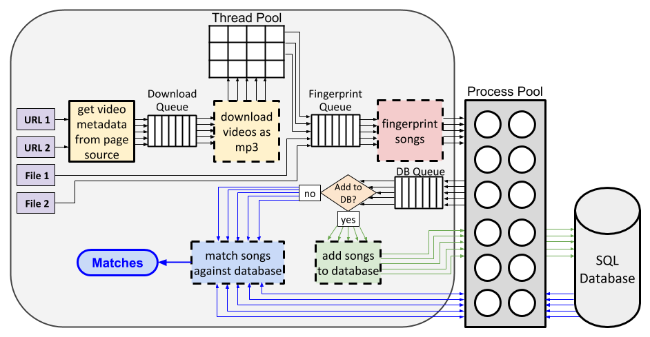

Architecture
============

Youtube Audio Matcher (YAM) leverages Python asynchronous functions and
coroutines, combined with multithreading and multiprocessing, to efficiently
download and/or process files, summarized in the flow diagram below.

Any number of YouTube channel/user URLs and local files/directories can be
provided as input. In the example above, these are labeled `URL 1`, `URL 2`,
`File 1`, and `File 2`. URLs can be any valid channel/user URL. The
channel/user Videos page URL is constructed from this URL by
:func:`youtube_audio_matcher.download.get_videos_page_url`.

The URLs are passed to a webscraping coroutine---the
`get video metadata from page source` block in the diagram, which corresponds
to :func:`youtube_audio_matcher.download.video_metadata_from_urls`---
asynchronously gets (via `Selenium`_) and parses (via `BeautifulSoup`_)
the complete page source for each URL and extracts information on each video
on the channel/user Videos page, namely the YouTube ID, duration, title. The
videos are filtered based on criteria supplied by the user (e.g., exclude
videos longer and/or shorter than a certain duration), after which they're
added to a download queue.

A download coroutine---`download videos as mp3` in the diagram, which
corresponds to :func:`youtube_audio_matcher.download.download_video_mp3s`---
kicks off each download in a thread pool, in which each video is downloaded
via youtube-dl and converted to MP3 by ffmpeg. Although encoding to MP3 by
ffmpeg is a CPU task and would theoretically benefit from multiprocessing,
we use a thread pool instead of the process pool because the computational
cost of encoding the MP3 is relatively small and its impact on performance
is negligible.

As each download completes, it's added to a fingerprint queue. Any local files
provided as input are added directly to the fingerprint queue, since they
don't need to be downloaded. A third coroutine---`fingerprint songs`,
corresponding to :func:`youtube_audio_matcher.audio.fingerprint_songs`---
consumes songs from the fingerprint queue and sends them to a process pool,
where they are fingerprinted (see :doc:`fingerprinting`) using all available
CPUs (see :func:`youtube_audio_matcher.audio.fingerprint_from_file`). After
fingerprinting, each video is added to a database queue.

If the user opted to add songs to the database, the fingerprinted files are
passed to a coroutine (`add songs to database`, corresponding to
:func:`youtube_audio_matcher.database.update_database`) that uses the process
pool to add the new songs/fingerprints to the database.

If the user instead opted to match the input songs against the fingerprints
already in the database, the songs are passed to a coroutine that uses the
process pool to query the database and determine if there's a match
(`match songs against database`, corresponding to
:func:`youtube_audio_matcher.match_songs` and
:func:`youtube_audio_matcher.match_fingerprints`). All matches are returned
and optionally written to a text file as JSON.

.. _`BeautifulSoup`:
  https://www.crummy.com/software/BeautifulSoup/

.. _`Selenium`:
  https://github.com/SeleniumHQ/selenium/
