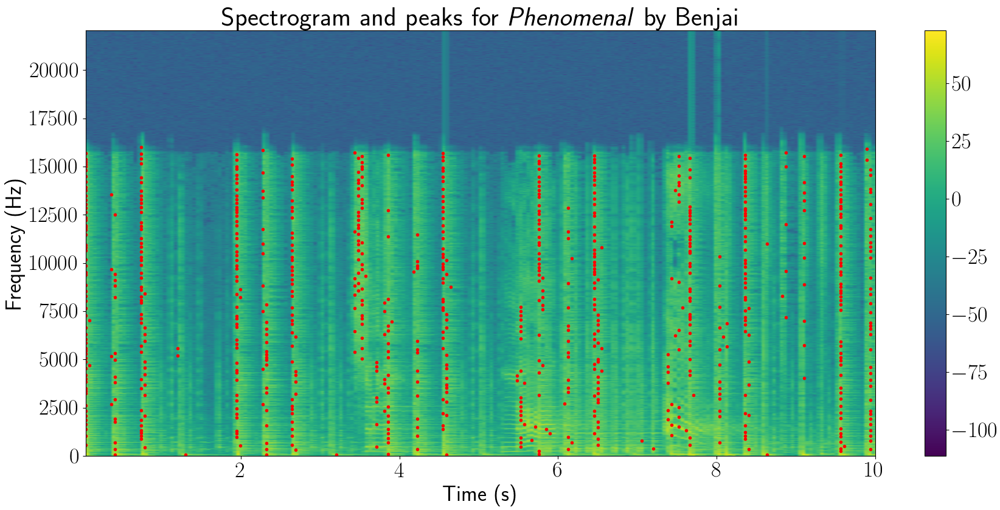

Audio Fingerprinting
====================

Audio fingerprinting refers to the act of turning audio into a set of hashes.
The first step of this involves obtaining the `spectrogram`_ of the song/audio,
which is effectively a measure of the intensity of the sound frequencies of the
audio over the course of the song. The spectrogram of the song *Phenomenal* by
Benjai is shown below.

.. note::
  The images in this section were generated by the :doc:`yamfp` command line
  tool.

.. image:: img/spec_full.png

Next, we find the peaks in the spectrogram, i.e., the points in the spectrogram
with the greatest amplitude. The spectrogram for the first 10 seconds of the
song is shown below, with the peaks represented by red dots.

The song's fingerprints are generated from peaks of pairs in a process known
as combinatorial hashing, where we iterate through the peaks and, for each
peak, form pairs with its neighbors. The number of neighbors we consider is
termed the *fanout* value. This is shown in the figures below, which are taken
from the paper by Avery Wang, the founder of Shazam (see
[Acknowledgments](#acknowledgments)).

.. image:: img/combinatorial_hashing.png

The figure defines a "target zone" that determines which neighbors to consider
for each peak. Each peak pair is used to generate a hash based on the frequency
and time difference between each point—this constitutes a fingerprint. If we
use a target zone of +1 s to +10 s (and no restriction on the frequency) with a
fanout value of 2, the first 10 seconds of the song generate the following
*hash constellation*:

.. image:: img/fingerprint_hash_pairs_10_fanout2.png

If we increase the fanout value to 6, it looks more like the following:

.. image:: img/fingerprint_hash_pairs_10_fanout6.png

Increasing the fanout value results in more hash pairs, increasing the
robustness of the fingerprints but also increasing storage requirements
and computation time to find matches, since there can be tens or hundreds
of thousands of hash pairs for an entire song.

More on the algorithm used to match audio fingerprints to fingerprints in the
database can be found in the paper and in the source code (see
:func:`youtube_audio_matcher.audio.align_matches`).

.. _`spectrogram`:
  https://en.wikipedia.org/wiki/Spectrogram
